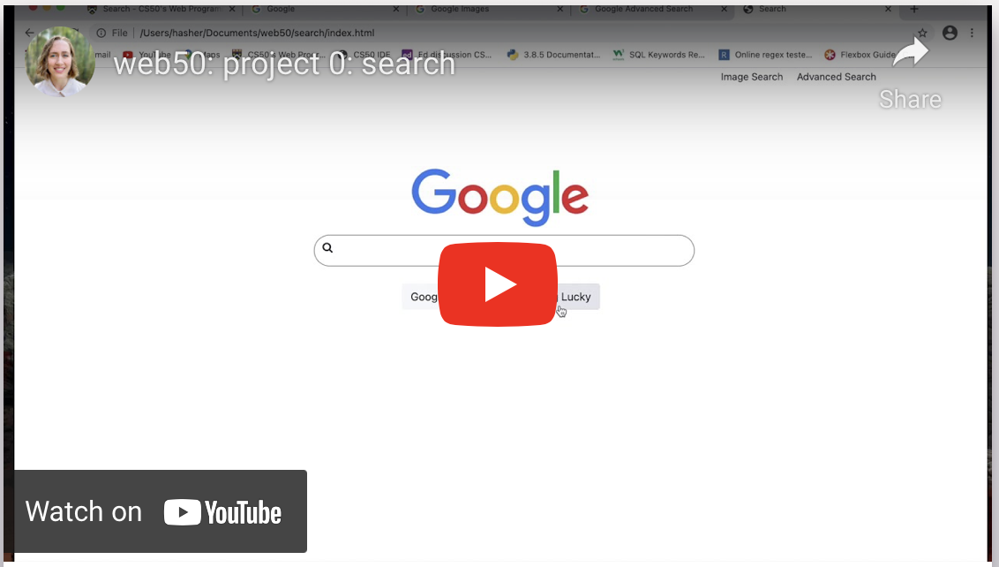

# Google Clone

## Technologies

* HTML
* CSS

## Summary

This is a solo front-end mini-project. The goal of the project is to replicate Google's homepage, image search, and advanced search pages. This primarily meant practicing HTML and CSS to make a visually similar clone, although part of the work was also to decipher and understand Google querystrings to figure out what the GET parameters should be for each form.

## Video Demo

## How To Run

Clone this repo and launch the site with Live Server extension for Visual Studio Code.

---

This was my first assignment for Harvard's CS50 course 'Web Programming with Python and JavaScript'. You can read the full assignment specification on [CS50's OpenCourseWare](https://cs50.harvard.edu/web/2020/projects/0/search/)